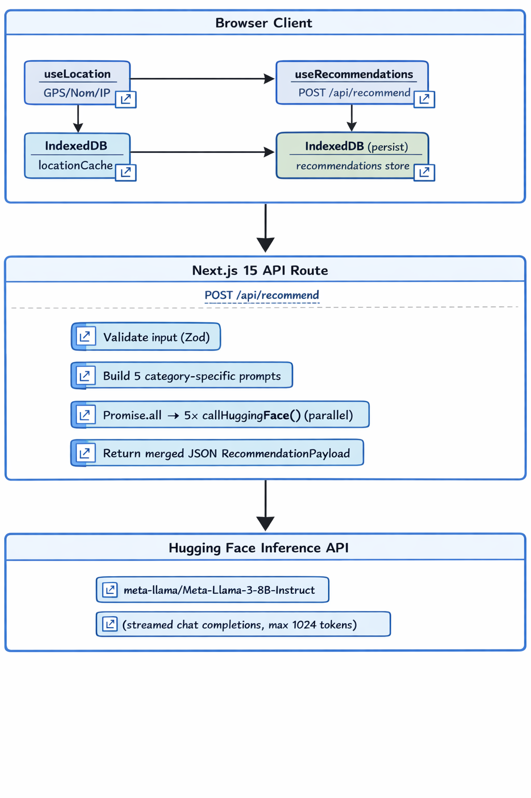
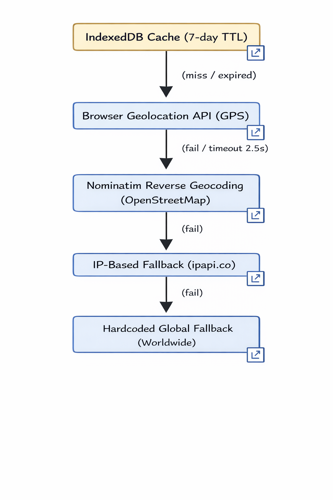

<p align="center">
  
</p>

<h1 align="center">Career Atlas</h1>

<p align="center">
  <em>Ambient location-aware career resource recommender — powered by AI, built for offline-first.</em>
</p>

<p align="center">
  <a href="https://github.com/ronaldgosso/career-atlas/actions/workflows/ci.yml">
    
  </a>
  <a href="https://nextjs.org/">
    
  </a>
  <a href="https://react.dev/">
    
  </a>
  <a href="https://www.typescriptlang.org/">
    
  </a>
  <a href="https://vercel.com/">
    
  </a>
  <a href="https://huggingface.co/">
    
  </a>
</p>

<p align="center">
  <a href="#-features">Features</a> ·
  <a href="#-architecture">Architecture</a> ·
  <a href="#-quick-start">Quick Start</a> ·
  <a href="#-tech-stack">Tech Stack</a> ·
  <a href="#-whats-next">What's Next</a> ·
  <a href="#-contributing">Contributing</a> ·
  <a href="#-license">License</a>
</p>

---

## 🧭 Overview

**Career Atlas** is an intelligent career resource recommender that tailors books, video tutorials, hands-on projects, online courses, and professional job titles with salary ranges to **your geographic location** and **chosen professional field**.

It works **offline-first** — every recommendation is cached locally via IndexedDB, so you can revisit your career library without a network connection. The app auto-detects your region using GPS, reverse geocodes with OpenStreetMap/Nominatim, and gracefully falls back to IP-based geolocation.

> **Currently focused on Tech/IT fields** — with Finance, Healthcare, and more on the roadmap. See [What's Next](#-whats-next) for details.

---

## ✨ Features

<table>
  <tr>
    <td><b>📍 Location-Aware</b></td>
    <td>Auto-detects your city and country via GPS, with Nominatim reverse-geocoding and IP fallback. Location cached for 7 days.</td>
  </tr>
  <tr>
    <td><b>🤖 AI-Powered Recommendations</b></td>
    <td>Leverages Meta-Llama-3-8B-Instruct (via Hugging Face) to generate 5 categories of career resources in parallel.</td>
  </tr>
  <tr>
    <td><b>📚 5 Recommendation Categories</b></td>
    <td>Books, Video Tutorials, Hands-on Projects, Online Courses, and Professional Job Titles with salary ranges.</td>
  </tr>
  <tr>
    <td><b>🌐 Offline-First Dashboard</b></td>
    <td>All recommendations are persisted to IndexedDB. Browse your full history offline on the Dashboard page.</td>
  </tr>
  <tr>
    <td><b>📥 Export &amp; Clear Cache</b></td>
    <td>Export all cached recommendations as JSON or print-ready PDF. Clear cache with confirmation.</td>
  </tr>
  <tr>
    <td><b>🔄 Cancel &amp; Retry</b></td>
    <td>Abort in-flight AI requests mid-stream. Retry failed generations with a single click.</td>
  </tr>
  <tr>
    <td><b>🎬 Gemini Video Search</b></td>
    <td>Optional Google Gemini integration for real-time YouTube video search. Replaces AI-generated videos with verified, currently available results.</td>
  </tr>
  <tr>
    <td><b>🎨 Deep Ocean Theme</b></td>
    <td>Polished dark UI with teal/cyan accents, animated loading states, and responsive design.</td>
  </tr>
  <tr>
    <td><b>🔒 Security Headers</b></td>
    <td>X-Frame-Options, X-Content-Type-Options, Referrer-Policy, and more configured via Vercel.</td>
  </tr>
</table>

---

## 🎬 Gemini Video Search (Optional)

By default, video recommendations are generated by **Meta-Llama-3-8B**, which can suggest titles that don't actually exist on YouTube. Enable **Google Gemini** to get real, currently available videos:

| | Without Gemini | With Gemini |
|---|---|---|
| **Source** | Llama 3 AI (generative) | Gemini 2.0 Flash + Google Search |
| **Accuracy** | May suggest non-existent videos | Verified, real YouTube URLs |
| **Speed** | Fast (~2-3s) | Slightly slower (~5-8s) |
| **Cost** | Free (Hugging Face) | Free tier available on Google AI Studio |
| **Setup** | None — works out of the box | Add `GOOGLE_GEMINI_API_KEY` to `.env.local` |

**How it works:**
1. Toggle "Enable Gemini" in the Field Selector before choosing your field
2. The API routes your video search through Gemini's Google Search grounding tool
3. Gemini searches YouTube for currently available videos matching your field and region
4. If Gemini fails or is unavailable, it gracefully falls back to Llama 3

---

## 🏗️ Architecture


### Location Resolution Pipeline


---

## 🚀 Quick Start

### Prerequisites

- **Node.js** 20.x or 22.x
- **npm** (comes with Node.js)
- A free **Hugging Face** account and API token

### 1. Clone the repository

```bash
git clone https://github.com/ronaldgosso/career-atlas.git
cd career-atlas
```

### 2. Install dependencies

```bash
npm install
```

### 3. Set up environment variables

```bash
cp .env.example .env.local
```

Then edit `.env.local` and add your Hugging Face API token:

```env
HUGGINGFACE_API_KEY=hf_your_token_here
```

> Get a free token at [huggingface.co/settings/tokens](https://huggingface.co/settings/tokens) — read access is sufficient.

**(Optional)** Add a Google Gemini API key for real-time YouTube video search:

```env
GOOGLE_GEMINI_API_KEY=AIzaSy...
```

> Get a free key at [aistudio.google.com/apikey](https://aistudio.google.com/apikey). Without it, video recommendations are AI-generated by Llama 3 (may suggest non-existent videos).

### 4. Run the development server

```bash
npm run dev
```

Open [http://localhost:3000](http://localhost:3000) in your browser.

### 5. Production build

```bash
npm run build    # lint + typecheck + build
npm run start    # production server
```

---

## 🛠️ Tech Stack

| Layer | Technology |
|---|---|
| **Framework** | [Next.js 15](https://nextjs.org/) (App Router) |
| **UI Library** | [React 19](https://react.dev/) |
| **Styling** | [Tailwind CSS 3.4](https://tailwindcss.com/) |
| **Language** | [TypeScript 5.7](https://www.typescriptlang.org/) |
| **AI Engine** | [@huggingface/inference](https://huggingface.co/docs/huggingface.js) × Meta-Llama-3-8B-Instruct |
| **Video Search** | [Google Gemini](https://ai.google.dev/) 2.0 Flash with Google Search grounding (optional) |
| **Validation** | [Zod](https://zod.dev/) |
| **Local Storage** | [IndexedDB](https://developer.mozilla.org/en-US/docs/Web/API/IndexedDB_API) via [idb](https://github.com/jakearchibald/idb) |
| **Geolocation** | Browser Geolocation API · [Nominatim](https://nominatim.openstreetmap.org/) · [ipapi.co](https://ipapi.co/) |
| **Deployment** | [Vercel](https://vercel.com/) |
| **CI/CD** | GitHub Actions (Node 20 &amp; 22, lint + typecheck + build) |

---

## 📦 Project Structure

```
career-atlas/
├── app/
│   ├── api/recommend/route.ts   ← AI recommendation endpoint
│   ├── dashboard/page.tsx        ← Offline cache viewer
│   ├── layout.tsx                ← Root layout + nav
│   ├── page.tsx                  ← Home: location + field + results
│   ├── global.css                ← Tailwind + custom CSS vars
│   ├── error.tsx                 ← Error boundary
│   └── not-found.tsx             ← 404 page
├── components/
│   ├── field-selector.tsx        ← 10-field selection grid
│   ├── recommendations-dashboard.tsx  ← Tabbed results view
│   ├── loading-orb.tsx           ← Animated spinner
│   ├── location-switcher.tsx     ← Manual city override
│   ├── cache-controls.tsx        ← Export JSON / Clear cache
│   └── offline-indicator.tsx     ← Offline mode pill
├── hooks/
│   ├── use-location.ts           ← GPS → Nom → IP resolution
│   ├── use-ambient-locations.ts  ← (legacy) simpler GPS hook
│   └── use-recommendations.ts    ← AI fetch lifecycle
├── lib/
│   ├── ai-client.ts              ← Hugging Face streaming client
│   ├── ai-stream-parser.ts       ← JSON stream parser
│   ├── cache-manager.ts          ← IndexedDB CRUD helpers
│   ├── db.ts                     ← IndexedDB initialization
│   ├── gemini-youtube.ts         ← Gemini-powered YouTube search (optional)
│   ├── location.ts               ← Geolocation utilities
│   ├── pdf-export.ts             ← jsPDF report generation
│   └── validators.ts             ← Zod schemas
├── public/
│   ├── icon-512.png              ← App logo (compass)
│   └── ...                       ← Favicons, manifest icons
├── .github/workflows/
│   └── ci.yml                    ← CI pipeline
└── package.json
```

---

## 🔮 What's Next

### Fields of Study 📋

| Status | Field | Description |
|---|---|---|
| ✅ | **Information Technology (IT)** | General IT careers |
| ✅ | **Data Science & Analytics** | Data engineering, analytics, BI |
| ✅ | **Cybersecurity** | Security, penetration testing, SOC |
| ✅ | **Software Engineering** | Full-stack, backend, frontend dev |
| ✅ | **Cloud & DevOps** | AWS, Azure, GCP, CI/CD, IaC |
| ✅ | **UI/UX Design** | User research, prototyping, design systems |
| ✅ | **Product Management** | Agile, roadmapping, stakeholder mgmt |
| ✅ | **Machine Learning Engineering** | MLOps, model training, deployment |
| ✅ | **Network Administration** | Routing, switching, wireless |
| ✅ | **Digital Marketing Tech** | MarTech, analytics, automation |
| ✅ | **Finance & Accounting** | Financial analysis, accounting, fintech |
| ✅ | **Law & Legal Tech** | Legal research, compliance tech |
| ✅ | **Healthcare & MedTech** | Health informatics, clinical tech |
| ✅ | **Education & EdTech** | Curriculum design, learning platforms |
| 🔲 | **Creative Arts & Media** | Graphic design, video production, writing |
| 🔲 | **Engineering & Manufacturing** | Mechanical, electrical, civil engineering |
| 🔲 | **Hospitality & Tourism** | Hotel management, travel tech, event planning |
| 🔲 | **Agriculture & AgriTech** | Farm management, food science, sustainability |
| 🔲 | **Construction & Real Estate** | Architecture, property management, smart buildings |
| 🔲 | **Transportation & Logistics** | Supply chain, fleet management, aviation tech |

### Regions & Locations 🌍

| Status | Region | Notes |
|---|---|---|
| ✅ | **Tanzania** | Full support — Dar es Salaam, Dodoma, Arusha, Mwanza, Zanzibar |
| ✅ | **Global (via GPS)** | Any city detected by Nominatim |
| ✅ | **Manual Override** | 12 major cities (NY, London, Berlin, Tokyo, Mumbai, etc.) |
| 🔲 | **Expanded African Regions** | Kenya, Nigeria, South Africa, Ghana, Rwanda, Ethiopia |
| 🔲 | **Southeast Asia** | Indonesia, Philippines, Vietnam, Thailand, Malaysia |
| 🔲 | **South America** | Brazil, Argentina, Colombia, Chile, Peru |
| 🔲 | **Regional Salary Calibration** | Local currency symbols and PPP-adjusted ranges per country |

### Features & Enhancements 🚀

- [ ] **Multi-language support** (Swahili, Spanish, French, Arabic)
- [ ] **User profiles** — save preferences, track skill progression
- [x] **PDF export** of recommendation reports
- [x] **Gemini-powered YouTube search** — real-time, verified video recommendations
- [ ] **Share recommendations** via shareable links
- [ ] **AI-powered chat** — ask follow-up questions about any recommendation
- [ ] **Community rankings** — upvote/downvote AI suggestions
- [ ] **Dark/Light theme toggle**
- [ ] **PWA install** — full offline app experience
- [ ] **Analytics dashboard** — track career growth milestones
- [ ] **Resume builder** — auto-generate resumes from selected resources
- [ ] **Interview prep** — field-specific interview questions and tips
- [ ] **Mentorship matching** — connect with professionals in your field

---

## 🤝 Contributing

Contributions are welcome! Here's how you can help:

1. **Fork** the repository
2. Create your feature branch (`git checkout -b feature/AmazingFeature`)
3. Commit your changes (`git commit -m 'Add some AmazingFeature'`)
4. Push to the branch (`git push origin feature/AmazingFeature`)
5. Open a **Pull Request**

### Development Commands

```bash
npm run dev        # Start dev server (Turbopack)
npm run build      # Full build (lint + typecheck + compile)
npm run start      # Production server
npm run lint       # ESLint
npm run typecheck  # TypeScript type checking
npm run ci         # Full CI pipeline (lint + typecheck + build)
```

---

## 📄 License

This project is licensed under the **GNU General Public License v2.0** — see the [LICENSE](LICENSE) file for details.

---

## 🙏 Acknowledgments

- **[Hugging Face](https://huggingface.co/)** — AI inference infrastructure
- **[Meta Llama 3](https://llama.meta.com/)** — Open-source language model
- **[OpenStreetMap](https://www.openstreetmap.org/)** — Free geocoding via Nominatim
- **[ipapi.co](https://ipapi.co/)** — IP-based geolocation fallback
- **[Vercel](https://vercel.com/)** — Hosting and edge infrastructure

---

<p align="center">
  Made with 💙 by <a href="https://github.com/ronaldgosso">Ronald Gosso</a>
</p>
